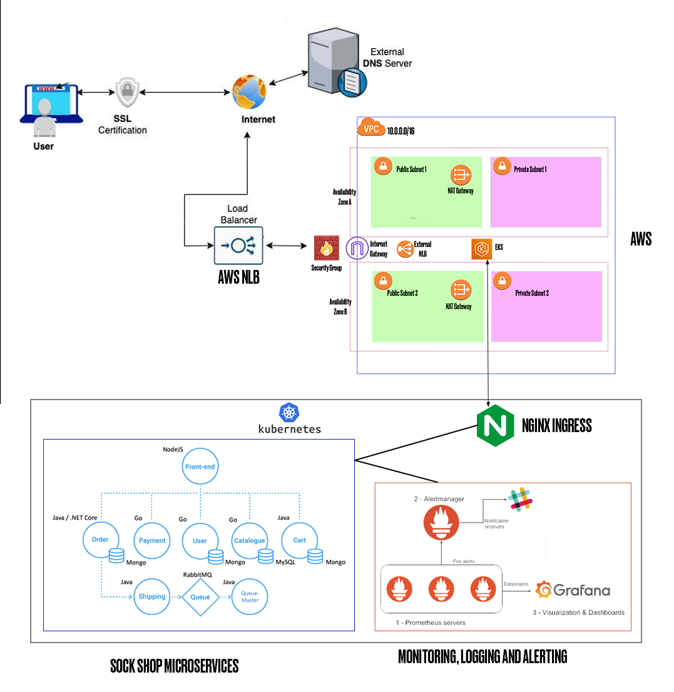

# WeaveSocks' Sock Shop Infrastructure

This repo contains the Amazon Web Services (AWS) IaaC (Infrastructure as Code) for **WeaveSocks**'s sock shop, which is a microservices-based application deployed on kubernetes. It also serves as the solution to my AltSchool Capstone Project.

- **Name: Ilodiuba Victor Nnamdi**
- **School: School of Engineering**
- **Track: Cloud Engineering**
- **ID No: ALT/SOE/023/3812**

## Table of Contents

- [Objective](#objective)
  - [Resources](#resources)
- [Infrastructure Diagram](#infrastructure-diagram)
- [File Structure](#file-structure)
- [Infrastructure](#infrastructure)
- [Deployment Pipeline](#deployment-pipeline)
- [Monitoring and Alerts](#monitoring-and-alerts)

## Objective

We aim to deploy a microservices-based application, specifically the Socks Shop, using a modern approach that emphasizes automation and efficiency. The goal is to use Infrastructure as Code (IaaC) for rapid and reliable deployment on Kubernetes.

### Resources

Socks Shop's Microservices Kubernetes manifests can be found on: https://github.com/microservices-demo/microservices-demo/tree/master/deploy/kubernetes

## Infrastructure Diagram



## File Structure

The following is an overview of the file structure for this project:

```
weavesocks-infrastructure/
├── aws/
├── helm/
├── k8s/
├── init.tf
├── main.tf
└── variables.tf
```

- [aws](./aws/): Contains the infrastructure for all Amazon Web Services used for this deployment. To see more information on the AWS infrastructure, check the the README file [here](./aws/).
- [helm](./helm/): Contains the infrastructure for Helm chart repositories and installation for the EKS cluster. To see more information on the helm infrastructure, check the the README file [here](./helm).
- [k8s](./k8s/): Contains the infrastructure for all kubernetes resources required for the kubernetes deployment. To see more information on the Kubernetes infrastructure, check the the README file [here](./k8s).
- [main.tf](main.tf): Contains the main infrastructure setup
- [init.tf](init.tf): Contains Initialization configuration for Terraform
- [variables.tf](variables.tf): Contains the variables used in Terraform

To see more information about each infrastructure, open their directories.

## Infrastructure

The Infrastructure is divided into 3 major modules. They are `aws`, `k8s`, and `helm`.

- The **aws** module contains the infrastructure for the Amazon Web Services utilized to provide hosting for the Kubernetes cluster required. To see a breakdown of the AWS infrastructure, and the decisions that brought about the infrastructure, check the the README file [here](./aws/).

- The **k8s** module contains the infrastructure for the Kubernetes deployment required for the Sock Shop Microservice application. To see a breakdown of the Kubernetes deployment, and the decisions that brought about the infrastructure, check the the README file [here](./k8s/).

- The **helm** module contains configurations for Helm chart installations that help the application run and meet the specified requirements. To see a breakdown of the Helm charts, and the decisions that originated them, check the the README file [here](./helm/).

## Deployment Pipeline

The CI/CD pipeline is handled by GitHub Actions. The workflow is contained in [.github/workflows/deploy.yml](./.github/workflows/deploy.yml). It installs the latest version of Terraform CLI and configures the Terraform CLI configuration with an API token for Terraform Cloud. On pull request events, the workflow will run `terraform init`, `terraform fmt`, and `terraform plan`. On push events to the "master" branch, `terraform apply` will be executed.

To use the workflow, a Terraform Cloud user API token was generated and stored as a GitHub secret which was then referenced in the [workflow file](./.github/workflows/deploy.yml).

A Terraform Cloud user account was used so the state of all resources could be stored and retrieved by GitHub Actions and also it can available to anyone with access to the Terraform Cloud user account.

Environment variables and Terraform variables were also stored in the user account's organisation workspace to provide security for sensitive data.

## Monitoring, Logging and Alerts

Service monitoring, logging and alerts are handled by Prometheus, Grafana, and AlertManager. Their configuration and more details about them can be found at [k8s/monitoring](./k8s/monitoring/).

## Screenshots

- The Sock Shop's frontend home page running on my domain `victorilodiuba.me` with HTTPS encryption.
  

- The view of the shopping cart page.
  

- The view of the catalogue page.
  

- The view of the users and orders page.
  

- Page containing description of a specific order.
  

- Page containing description of a specific product.
  

- The grafana service running on my sub domain `grafana.victorilodiuba.me` with HTTPS encryption.
  

- The grafana dashboards.
  

- Grafana Metrics for my Kubernetes nodes.
  

- Grafana Metrics for samples ingested by prometheus, how frequently targets are scraped and how long the scrapes are taking.
  

- Grafana metrics for total logins, projected number of orders per day and the total amount of orders placed in the past hour.
  

- Grafana metrics for the latency of each service and their queries per second(QPS).
  
  
  

- Alerts on prometheus
  

- Executing a query on prometheus
  
