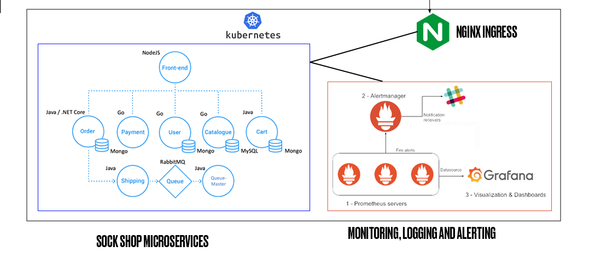

# Kubernetes Deployment

This directory contains the infrastructure for the **Kubernetes** deployment in the [EKS cluster](../aws/). The Kubernetes deployment include the `sock shop` microservice application and it's required resources, `monitoring` tools including Prometheus and Grafana, `alerting` tools including Alertmanager and a `Cluster Issuer` to issue the Let's Encrypt certificate.

## Table of Contents

- [Microservices Architecture](#microservices-architecture)
- [File Structure](#file-structure)
- [Implentation Decisions](#implementation-decisions)
  - [Alerting](#alerting)
  - [Cluster Issuer](#cluster-issuer)
  - [Monitoring and Logging](#monitoring-and-logging)
  - [Sock Shop](#sock-shop)


## Microservices Architecture



## File Structure

The following is an overview of the file structure for this infrastructure:

```
k8s/
├── alerting/
  ├── modules/
    ├── alertmanager/
      ├── data/
      ├── deployment.tf
      ├── service.tf
      ├── outputs.tf
      └── variables.tf
    ├── config/
      ├── data/
      ├── configmap.tf
      ├── ingress.tf
      ├── outputs.tf
      ├── secret.tf
      └── variables.tf
    ├── main.tf
    └── variables.tf
├── cluster-issuer/
  ├── main.tf
  └── variables.tf
├── monitoring/
  ├── modules/
    ├── config/
      ├── data/
      ├── grafana-configmap.tf
      ├── ingress.tf
      ├── namespace.tf
      ├── outputs.tf
      ├── prometheus-configmap.tf
      ├── secret.tf
      └── variables.tf
    ├── tools/
      ├── grafana/
        ├── data/
        ├── deployment.tf
        ├── import-dashboard-job.tf
        ├── outputs.tf
        ├── service.tf
        └── variables.tf
      ├── kube-state/
        ├── cluster-role-binding.tf
        ├── cluster-role.tf
        ├── deployment.tf
        ├── service-account.tf
        ├── service.tf
        └── variables.tf
      ├── prometheus/
        ├── data/
        ├── node-exporter/
        ├── alert-rules.tf
        ├── cluster-role-binding.tf
        ├── cluster-role.tf
        ├── deployment.tf
        ├── export-disk-usage-ds.tf
        ├── node-exporter.tf
        ├── outputs.tf
        ├── service-account.tf
        ├── service.tf
        └── variables.tf
      ├── main.tf
      ├── outputs.tf
      └── variables.tf
    ├── main.tf
    └── variables.tf
  ├── main.tf
  └── variables.tf
├── sock-shop/
  ├── modules/
      ├── database/
        ├── carts-db/
          ├── deployment.tf
          ├── service.tf
          └── variables.tf
        ├── catalogue-db/
          ├── deployment.tf
          ├── service.tf
          └── variables.tf
        ├── orders-db/
          ├── deployment.tf
          ├── service.tf
          └── variables.tf
        ├── session-db/
          ├── deployment.tf
          ├── service.tf
          └── variables.tf
        ├── user-db/
          ├── deployment.tf
          ├── service.tf
          └── variables.tf
        ├── main.tf
        └── variables.tf
      ├── configmap.tf
      ├── database.tf
      ├── ingress.tf
      ├── namespace.tf
      ├── outputs.tf
      ├── secret.tf
      └── variables.tf
    ├── config/
    ├── services/
    ├── utils/
    ├── main.tf
    └── variables.tf
  ├── main.tf
  └── variables.tf
├── main.tf/
└── variables.tf/
```

- [alerting](./alerting/): Contains the terraform replication of the alertmanager kubernetes manifests for the sock shop application gotten from the GitHub Repo https://github.com/microservices-demo/microservices-demo/tree/master/deploy/kubernetes/manifests-alerting

  - [modules/alertmanager](./alerting/modules/alertmanager): Contains the terraform replication of the alertmanager deployment and service kubernetes manifest.
  - [modules/config](./alerting/modules/config): Contains extra configurations for an ingress for the alertmanager service, a Kubernetes secret to keep the sensitive values for the alertmanager safe, and a terraform replication of the alertmanager config map kubernetes manifest provided in the sock-shop repo.

- [cluster-issuer](./cluster-issuer/): Contains the configuration for the `ClusterIssuer` resource that provides the Let's Encrypt certificate for our cluster.

- [monitoring](./monitoring/): Contains the terraform replication of the kubernetes manifests for monitoring tools for the sock shop application gotten from the GitHub Repo https://github.com/microservices-demo/microservices-demo/tree/master/deploy/kubernetes/manifests-monitoring

  - [modules/tools](./monitoring/modules/tools): Contains the terraform replication of the Kubernetes manifests for Prometheus, Grafana and Kube-state tools used for monitoring activities on the app.
  - [modules/config](./monitoring/modules/config): Contains extra configurations for an ingress for the prometheus and grafana services, a Kubernetes secret to keep the sensitive values for grafana authentication safe, and a terraform replication of the kubernetes manifests for prometheus and grafana config maps, monitoring namespace provided in the sock-shop repo.

- [sock-shop](./sock-shop/): Contains the terraform replication of the kubernetes manifests for the microservice application gotten from the GitHub Repo https://github.com/microservices-demo/microservices-demo/tree/master/deploy/kubernetes/manifests
  - [modules/config](./sock-shop/modules/config): Contains extra configurations for an ingress for the frontend micrservice, a Kubernetes secret to keep the sensitive values like database passwords and names safe, and a terraform config map for storing microservice configuration values, sock-shop namespace, and the terraform replication of the Kubernetes manifests for the databases used by the application provided in the sock-shop repo.
  - [modules/services](./sock-shop/modules/services): Contains the terraform replication of the Kubernetes manifests for each microservice's deployment and service.
  - [modules/utils](./sock-shop/modules/utils): Contains the terraform replication of the Kubernetes manifests for utilities like `Queue Master` and `RabbitMQ` used by the application.

## Implementation Decisions

Most of the terraform resources here are terraform replications of the Kubernetes Manifests contained in the Sock-Shop Repo at https://github.com/microservices-demo/microservices-demo/tree/master/deploy/kubernetes.

I took some decisions to enhance performance and security of the application and you can find them below:

### Alerting

- The alertmanager deployment initially was set to take the Slack webhook URL from an environmental variable and then use the `sed` command in a shell script to insert the URL into the file `/etc/alertmanager/config.yml`. This was not possible because the file is mounted in a read-only volume through a config map, so this needed to be fixed.

  - To fix this, i added an init container that created a writable volume, then at point of start up for alertmanager, made the shell script copy the config file that would contain the URL to that writable volume, edit the file there and then use the edited file as the config file.
  - This can be seen in the configuration for the [Kubernetes deployment for alertmanager](./alerting/modules/alertmanager/deployment.tf)

- The alertmanager was kept in a different namespace from prometheus, and prometheus wasn't able to reach it because the alertmanager URL added to [prometheus.yml](./monitoring/modules/config/data/prometheus.yml) didn't initially contain the namespace.
  - I fixed this by adding the namespace to the url. This can be seen in [prometheus.yml](./monitoring/modules/config/data/prometheus.yml).

- I added a Ingress resource to the alertmanager service so it would be reachable through the internet.

  - This can be seen in [alerting's ingress](./alerting/modules/config/ingress.tf).

- I added a Kubernetes Secret resource to store the slack webhook URL safely.

  - This can be seen in the [slack hook url kubernetes secret](./alerting/modules/config/secret.tf)

- The other configurations are terraform repliactions of the Kubernetes manifests gotten from the Sock-Shop repository.

### Cluster issuer

- The application was required to be accessible through HTTPS using a Let's Encrypt certificate. CRDs for jetsack's cert-manager were installed in the cluster through [Helm](../helm/cert-manager.tf). For the certificate to be issued through Let's Encrypt, there was a need for a `ClusterIssuer` resource to be added, and the Kubernetes mainfest for this was gotten from jetsack's documentation.

- The terraform replication of the manifest can be found at [cluster-issuer/main.tf](./cluster-issuer/main.tf)

- The other configurations are terraform repliactions of the Kubernetes manifests gotten from the Sock-Shop repository.

### Monitoring and Logging

- The job that imports the grafana dashboards contained a script that initially contained sensitive values like username and password written in plain text. To fix this, i replaced them with terraform variables, so their actual values would be safely passed.

  - This is seen in [grafana import-dashboard-job](./monitoring/modules/tools/grafana/import-dashboard-job.tf) where Kubernetes secret is created and the script is inserted into the secret with the username and password gotten from a terraform variable.

- I added a Ingress resource that routes to the profana and grafana services so they would be reachable through the internet.

  - This is seen in [monitoring's ingress](./monitoring/modules/config/ingress.tf).

- I added a Kubernetes Secret resource to store the Grafana authentication data safely.

  - This is seen in [monitoring's kubernetes secret](./monitoring/modules/config/secret.tf).

- The other configurations are terraform repliactions of the Kubernetes manifests gotten from the Sock-Shop repository.

### Sock Shop

- The app was initially set to use the latest versions of MongoDB, but some queries used by some microservices was obsolete and no longer supported by new versions of MongoDB. To fix this, i set the MongoDB containers to older versions that supported the queries used the app.

  - A better fix would have been the developer of the app to change the outdated queries used the app to newer and supported ones, but i don't have access to the developer, so i decided to use an older version of MongoDB.
  - This is seen in [carts-db](./sock-shop/modules/config/database/carts-db/deployment.tf) and [orders-db](./sock-shop/modules/config/database/orders-db/deployment.tf) where the MongoDB versions are set to `4.4.29`.

- I added config maps to store some configurations for the app like `JAVA_OPTS`. This helps provide a single point of correction, seeing that multiple microservices use that variable, if the value needs to changed at any point in the future, only a single terraform variable would require change, instead of opening the configuration for each microservice and changing the value. This saves time and makes development and maintenance easier. It also improves security as the value can't been seen in plain text in the code.

  - This is seen in [sock shop's config map](./sock-shop/modules/config/configmap.tf) where the values for `java_opts`, `zipkin` and `session-redis` are gotten from a terraform variable and then stored in the config map. The config maps are then referenced in the configurations for the deployment of the microservices like [carts microservice](./sock-shop/modules/services/carts/deployment.tf).

- I added a Ingress resource that routes to the frontend services so it would be reachable through the internet.

  - This is seen in [sock shop's ingress](./sock-shop/modules/config/ingress.tf).

- I added a Kubernetes Secret resource to store database passwords and names safely.

  - This is seen in [sock shop's kubernetes secret](./sock-shop/modules/config/secret.tf).

- The other configurations are terraform repliactions of the Kubernetes manifests gotten from the Sock-Shop repository.
